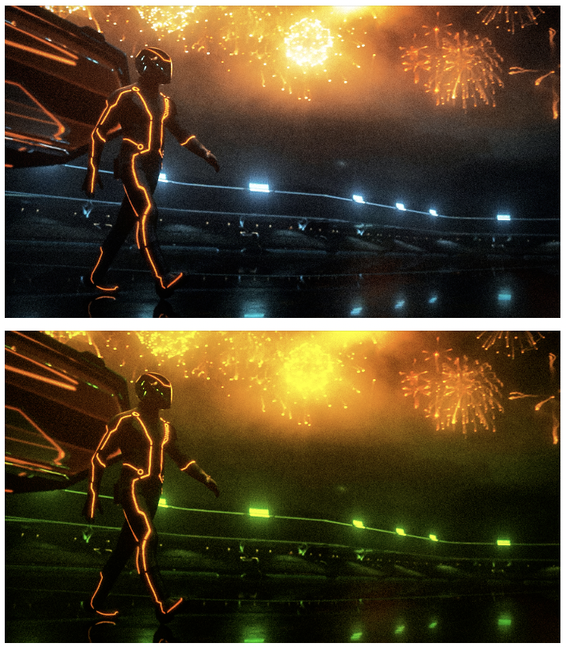

# PixelStateTransform
quantum-inspired image processing system that maps pixels to quantum states, applying amplitude transformations, error correction, and coherence decay for visual transformations.

# howto:

`git clone https://github.com/NeoVertex1/PixelStateTransform.git`

`cd PixelStateTransform`

`cd src`

`gcc -o quantum_image quantum_image.c -lm`

run with image:

`./quantum_image input_image.jpg output_image.png`

## example:

### Technical Overview of Quantum State Simulation in Image Processing

This post explains how a classical simulation processes millions of quantum states derived from image pixels, it covers how the quantum states are stored, how pixels are mapped to these states, and how many quantum states are used during the process.

---

#### How the Code Stores Quantum States

 **Amplitude**:
   - A complex number $$(a + bi)$$ where the real part $$(a)$$ represents the red channel of a pixel, and the imaginary part $$(b)$$ represents the green channel.

**Metadata**:
   - **Protection Level**: Determines the error correction strength for the state.
   - **Coherence Time**: Indicates how long the quantum state remains stable before it starts degrading.
   - **Last Access Time**: Tracks when the state was last used to calculate error rates.

---

#### Pixel-to-Quantum-State Mapping

Each pixel in the input image is mapped to a quantum state. For a pixel with red (R), green (G), and blue (B) values:

**Red Channel (R)**: Maps to the real part of the amplitude.

**Green Channel (G)**: Maps to the imaginary part of the amplitude.

**Blue Channel (B)**: Not used in the quantum state representation.

The mapping formula is:
$$\[
\text{Amplitude} = \frac{R}{255} + \frac{G}{255} \cdot i
\]$$

For an image of size $$\(1920 \times 1080\)$$, each of the $$\(2,073,600\)$$ pixels corresponds to one quantum state, resulting in $$\(2,073,600\)$$ quantum states.

---

#### Quantum State Processing

The code simulates quantum effects using mathematical transformations applied to the amplitudes of the quantum states:

**Amplitude Transformation**:

   Each state’s amplitude undergoes a phase shift based on its protection level:
   $$\[
   \text{Amplitude} \gets \text{Amplitude} \cdot e^{i \cdot \phi^{\text{ProtectionLevel}}}
   \]$$
   Here, $$\(\phi\)$$ is the golden ratio, and the protection level adds complexity to the transformation.

**Error Correction**:

   If the state’s error rate exceeds a threshold, the amplitude is adjusted:
   $$\[
   \text{Amplitude} \gets \text{Amplitude} \cdot e^{i \cdot \sqrt{\psi \cdot \xi} \cdot \phi^{\text{ProtectionLevel}}}
   \]$$
   Constants $$\(\psi\)$$ and $$\(\xi\)$$ define the stability of the simulated quantum system.

**Coherence Decay**:

   Each quantum state has a coherence time. If the elapsed time since the last access exceeds this coherence time, the state degrades to zero amplitude.

---

#### Image Reconstruction

After processing, the quantum states are converted back to pixel values:

1. **Red Channel (R)**: Real part of the amplitude, scaled to the range [0, 255].
2. **Green Channel (G)**: Imaginary part of the amplitude, scaled similarly.
3. **Blue Channel (B)**: Set to zero. (!)

#### Computational Details

**Number of Quantum States**:
   For an image with $$\(1920 \times 1080\)$$ resolution, there are $$\(2,073,600\)$$ quantum states, corresponding to the number of pixels.

**Memory Usage**:
   Each quantum state uses:
   - $$\(16 \, \text{bytes}\)$$ for the complex amplitude (real and imaginary parts).
   - $$\(16 \, \text{bytes}\)$$ for metadata (protection level, coherence time, and last access time).

   Total memory required for all quantum states:
   $$\[
   2,073,600 \times (16 + 16) = 66.3 \, \text{MB}
   \]$$

**Processing Complexity**:
   Each quantum state undergoes amplitude transformations, error corrections, and coherence checks, leading to millions of mathematical operations performed during image processing.

---

#### Summary

- The quantum states are stored as classical structures in RAM.
- Each pixel maps to one quantum state with a complex amplitude derived from its red and green channels.
- For a $$\(1920 \times 1080\)$$ image, $$\(2,073,600\)$$ quantum states are processed.

